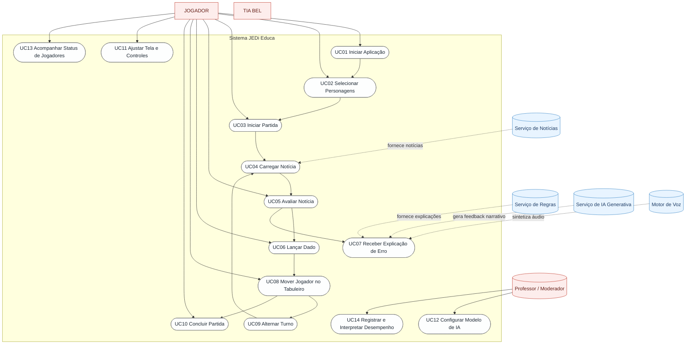

# Especificação de Casos de Uso – JEDi Educa

## Visão Geral
O JEDi Educa é um jogo educativo digital voltado para alfabetização midiática, cujo objetivo é ensinar crianças e adolescentes a reconhecerem notícias falsas (“fake news”). O jogo combina mecânicas de tabuleiro, avaliação de notícias e interações multimídia (narrativas, sons e animações) para engajar o público-alvo em uma experiência lúdica enquanto desenvolve pensamento crítico.

Esta especificação descreve os principais casos de uso do sistema, considerando tanto jogadores quanto integrações externas necessárias para o funcionamento pleno da aplicação.

%% Diagrama de Casos de Uso – JEDi Educa
%% Representa atores, subsistemas e principais casos de uso descritos no documento

## Atores
- **Jogador**: pessoa que interage com o jogo, podendo jogar sozinho ou em grupo (modo multiplayer local compartilhado).
- **Narradora (Tia Bel)**: personagem virtual que orienta, celebra acertos e explica erros. Atua como feedback auditivo e visual, mas não realiza ações por conta própria.
- **Serviço de Notícias**: API externa que fornece perguntas e dados de notícias a serem avaliadas.
- **Serviço de Regras**: API externa que retorna explicações estruturadas para justificar por que uma notícia é falsa ou verdadeira, usada em caso de erro do jogador.
- **Serviço de IA Generativa (LLM)**: provê respostas textuais em linguagem natural para narrativas adaptativas, conforme persona configurada.
- **Motor de Sintetização de Voz**: converte texto das narrativas em áudio reproduzido durante o jogo.

## Premissas Gerais
- O acesso às APIs externas depende de conectividade com a internet.
- A partida ocorre em um único dispositivo (desktop, tablet ou celular) compartilhado entre os jogadores.
- O jogo possui fluxo principal baseado em rodadas e estados controlados por uma máquina de estados finitos.
- Os casos de uso são descritos em nível funcional, focando no comportamento esperado pelo usuário.

## Casos de Uso

### UC01 – Iniciar Aplicação
**Ator Primário:** Jogador  
**Pré-condições:** Aplicação instalada/implantada e acessível.  
**Pós-condições de Sucesso:** Tela inicial carregada com a interface de seleção de personagens pronta.  
**Fluxo Principal:**
1. Jogador acessa a aplicação via navegador.
2. Sistema carrega recursos iniciais (mapa, sprites básicos, hooks de responsividade).
3. Sistema exibe aviso de orientação para dispositivos móveis (preferencialmente horizontal).
4. Sistema apresenta tela de seleção de personagens e tutorial curto sobre mecânica do jogo.

**Fluxos Alternativos:**
- Caso APIs externas não estejam disponíveis, o sistema exibe mensagem de erro/indisponibilidade e impede o início da partida (pode oferecer modo mock, dependendo da configuração).

### UC02 – Selecionar Personagens
**Ator Primário:** Jogador  
**Pré-condições:** UC01 concluído; lista de personagens carregada.  
**Pós-condições de Sucesso:** Lista de personagens selecionados pronta; sprites correspondentes pré-carregados.  
**Fluxo Principal:**
1. Jogador arrasta ou toca nos cartões de personagens disponíveis.
2. Sistema valida limite mínimo/máximo de jogadores (1–4).
3. Sistema adiciona automaticamente a personagem “Tia Bel” como NPC auxiliar (não controlável).
4. Jogador confirma seleção.
5. Sistema faz pré-carregamento dos sprites dos personagens escolhidos e apresenta progresso.
6. Ao completar o carregamento, o sistema sinaliza que a partida pode começar.

**Fluxos Alternativos:**
- Caso o carregamento de sprites falhe, o sistema exibe mensagem de erro e permite tentar novamente ou cancelar.

### UC03 – Iniciar Partida
**Ator Primário:** Jogador  
**Pré-condições:** UC02 concluído; sprites carregados; mapa isométrico disponível.  
**Pós-condições de Sucesso:** Jogadores posicionados na casa inicial; turno do primeiro jogador em andamento.  
**Fluxo Principal:**
1. Sistema posiciona todos os jogadores selecionados na casa inicial do tabuleiro e centraliza a câmera.
2. Sistema inicializa a máquina de estados do jogo em “AguardandoSeleção” → “AguardandoNoticia1”.
3. Sistema habilita botões de avaliação de notícias e aguarda o carregamento inicial de notícias.

### UC04 – Carregar Notícia
**Ator Primário:** Sistema (automático), com interação indireta do Jogador  
**Pré-condições:** UC03 em andamento; serviço de notícias disponível.  
**Pós-condições de Sucesso:** Notícia atual exibida ao jogador; painel de avaliação habilitado.  
**Fluxo Principal:**
1. Sistema solicita ao serviço de notícias uma lista contendo perguntas e metadados.
2. Sistema seleciona uma notícia aleatória que não tenha sido usada recentemente (evitar repetições).
3. Sistema pré-carrega imagem associada à notícia (se houver) para garantir suavidade na UI.
4. Sistema exibe texto, imagem e alternativas “FAKE” ou “NÃO FAKE”.
5. Sistema habilita estado “AvaliacaoNoticia” e aguarda resposta dos jogadores.

**Fluxos Alternativos:**
- Se o serviço de notícias retornar erro ou lista vazia, o sistema entra em fallback: mostra mensagem e impede avanço até nova tentativa.
- Caso todas as notícias tenham sido utilizadas, o sistema reinicia o ciclo reaproveitando o conjunto completo.

### UC05 – Avaliar Notícia
**Ator Primário:** Jogador ativo  
**Pré-condições:** UC04 concluído; botão de avaliação habilitado; jogador possui turno.  
**Pós-condições de Sucesso:** Resultado registrado; fluxo do turno segue para lançamento de dado ou explicação.  
**Fluxo Principal (Acerto):**
1. Jogador escolhe entre “FAKE” ou “NÃO FAKE”.
2. Sistema verifica resposta com base em `respCerta` da notícia.
3. Se correta, sistema incrementa contagem de acertos do jogador ou da equipe.
4. Sistema aciona animação comemorativa da Tia Bel e narração positiva.
5. Sistema habilita lançamento do dado (UC06) e transita para estado “LancamentoDado”.

**Fluxo Alternativo (Erro):**
1. Sistema registra avaliação incorreta.
2. Sistema chama serviço de regras para obter explicações detalhadas sobre a classificação.
3. Sistema aciona narração de feedback negativo e prepara painel de explicação.
4. Sistema transita para estado “FecharExplicacao” e desabilita controle até conclusão da explicação (UC07).
5. Sistema alterna para próximo jogador após apresentação da explicação.

### UC06 – Lançar Dado
**Ator Primário:** Jogador ativo  
**Pré-condições:** UC05 concluído com acerto; dado habilitado; jogador possui movimentos a executar.  
**Pós-condições de Sucesso:** Valor do dado determinado; movimentos definidos para o jogador ativo.  
**Fluxo Principal:**
1. Jogador clica/toque no dado virtual.
2. Sistema inicia animação e efeito sonoro de rolagem.
3. Sistema sorteia valor de 1 a 6 e registra internamente.
4. Sistema aplica fator de aceleração (quando configurado) para determinar quantidade de passos.
5. Sistema encerra animação, exibe valor e atualiza estado para “AnimacaoZoomIn”.
6. Sistema habilita movimento pelo tabuleiro (UC08).

**Fluxos Alternativos:**
- Se dado estiver desabilitado (por não ter avaliado a notícia), o sistema ignora interação.
- Se animação estiver em andamento, novas interações são bloqueadas até completar a rolagem.

### UC07 – Receber Explicação de Erro
**Ator Primário:** Jogador ativo (que errou), demais jogadores como coadjuvantes  
**Pré-condições:** UC05 concluído com erro; serviço de regras e LLM disponíveis.  
**Pós-condições de Sucesso:** Jogadores recebem feedback; turno passa ao próximo participante.  
**Fluxo Principal:**
1. Sistema apresenta painel com resumo da notícia e indica a resposta correta.
2. Sistema exibe selo visual (fake/not fake) correspondente.
3. Sistema sintetiza áudio utilizando texto retornado pelo LLM para explicar o erro de forma curta e coloquial.
4. Ao final da narração, sistema fecha painel de explicação e chama `nextTurn()` para avançar ao próximo jogador.
5. Sistema volta ao estado “AguardandoNoticia1” para a nova rodada.

**Fluxos Alternativos:**
- Se o serviço de regras falhar, sistema informa indisponibilidade e fornece alerta padrão.
- Se o serviço de LLM falhar, sistema usa texto padrão da regra ou fallback.

### UC08 – Mover Jogador no Tabuleiro
**Ator Primário:** Jogador ativo  
**Pré-condições:** UC06 concluído; valor do dado conhecido; mapa carregado.  
**Pós-condições de Sucesso:** Jogador deslocado o número de passos permitido ou até encontrar obstáculo/evento; turno preparado para finalização.  
**Fluxo Principal:**
1. Sistema inicia sequência de câmera (zoom in) e ajusta centro no jogador ativo.
2. Jogador utiliza setas do teclado, cliques no tabuleiro ou botões móveis para mover-se passo a passo.
3. A cada tentativa de movimento, sistema valida caminho (tile caminhável, distância compatível com movimentos restantes, ausência de bloqueios).
4. Sistema anima o sprite frame a frame durante deslocamento.
5. Ao finalizar movimentos ou atingir destino especial, sistema transita para “AguardandoZoomOut” → “AnimacaoZoomOut”.
6. Sistema reposiciona câmera para visão ampla e encerra turno atual.

**Fluxos Alternativos:**
- Se jogador escolher uma casa não caminhável, sistema ignora e mantém posição atual.
- Caso movimentos acabem antes de atingir objetivo, turno é encerrado normalmente.
- Ao alcançar casa final, sistema detona condição de vitória (UC10).
- Eventos especiais (ex.: skate park) podem alterar lógica de movimento, teletransportar jogador ou mudar animação temporariamente.

### UC09 – Alternar Turno
**Ator Primário:** Sistema (automático), acionado após conclusão de UC07 ou UC08  
**Pré-condições:** Jogador atual esgotou ações (avaliou notícia e moveu-se/recebeu feedback).  
**Pós-condições de Sucesso:** Próximo jogador definido como ativo; interface atualizada.  
**Fluxo Principal:**
1. Sistema identifica índice do jogador ativo e atualiza estado interno do `PlayerManager`.
2. Sistema destaca novo jogador no painel de turnos.
3. Sistema reposiciona câmera (se necessário) e reseta indicadores de movimentos.
4. Sistema inicia carregamento da próxima notícia (retorna ao UC04).

### UC10 – Concluir Partida
**Ator Primário:** Jogador ativo que alcança a casa final  
**Pré-condições:** UC08 levou jogador a tile final (`type = fim`).  
**Pós-condições de Sucesso:** Mensagem de vitória exibida; opção de reiniciar o jogo ou voltar à seleção.  
**Fluxo Principal:**
1. Sistema detecta player no tile final durante validação de movimento.
2. Sistema congela turnos restantes e impede novas ações.
3. Sistema exibe painel de vitória com resumo da partida (acertos, jogadores participantes).
4. Sistema aciona narração comemorativa da Tia Bel.
5. Jogador pode optar por reiniciar (retorna ao UC01/UC02) ou encerrar aplicação.

### UC11 – Ajustar Tela e Controles
**Ator Primário:** Jogador  
**Pré-condições:** Jogo em execução; controles exibidos.  
**Pós-condições de Sucesso:** Interface adaptada à orientação ou dispositivo do jogador.  
**Fluxo Principal:**
1. Jogador pode alternar para tela cheia (desktop) ou aceitar orientação horizontal (mobile).
2. Sistema monitora orientação do dispositivo e alerta se estiver em modo vertical inadequado.
3. Jogador pode usar controles mobile (setas e botão de dado) quando detectado dispositivo móvel.
4. Sistema ajusta zoom e escala dinamicamente para manter legibilidade independentemente da tela.

### UC12 – Configurar Modelo de IA
**Ator Primário:** Jogador (moderador/professor)  
**Pré-condições:** Jogo em execução; painel de configuração acessível.  
**Pós-condições de Sucesso:** Modelo de IA atualizado para gerar explicações.  
**Fluxo Principal:**
1. Jogador abre seletor de modelos de IA no topo da interface.
2. Jogador escolhe o modelo desejado (ex.: `gpt-4o`, `gemini` etc.).
3. Sistema atualiza configuração corrente e utilizará novo modelo no próximo feedback gerado.

**Fluxo Alternativo:**
- Se o modelo selecionado estiver indisponível, sistema exibe erro e mantém modelo anterior.

### UC13 – Acompanhar Status de Jogadores
**Ator Primário:** Jogador/espectador  
**Pré-condições:** Partida ativa; múltiplos jogadores configurados.  
**Pós-condições de Sucesso:** Jogadores visualizam ordem de turno e estado atual.  
**Fluxo Principal:**
1. Sistema exibe painel lateral com lista de jogadores e miniaturas dos personagens.
2. Sistema destaca o jogador ativo com ícone “Sua vez”.
3. Sistema atualiza painel a cada mudança de turno.

### UC14 – Registrar e Interpretar Desempenho
**Ator Primário:** Sistema (com logs para desenvolvedores/professores)  
**Pré-condições:** Partida em andamento; serviços de monitoramento ativos.  
**Pós-condições de Sucesso:** Eventos relevantes logados; dados disponíveis para análise posterior.  
**Fluxo Principal:**
1. Sistema registra eventos de performance (tempo de carregamento de notícias, duração de animações, latência de respostas externas) via `perfDiagnostics`.
2. Logs podem ser exportados ou inspecionados por desenvolvedores para otimização.
3. Professores podem utilizar relatórios (quando implementados) para entender acertos e erros dos alunos.

## Requisitos Não Funcionais Relacionados aos Casos de Uso
- **Performance:** carregamento assíncrono de sprites e notícias deve ocorrer sob 2 segundos em conexões típicas escolares.
- **Compatibilidade:** jogo deve rodar em navegadores modernos (Chrome, Edge, Firefox, Safari) com suporte a WebGL e Web Audio.
- **Acessibilidade:** interface deve fornecer textos alternativos, feedbacks visuais e auditivos, e permitir uso em tablets.
- **Confiabilidade:** tratar indisponibilidade das APIs externas com mensagens claras e tentativa de reconexão.
- **Segurança:** comunicação com APIs deve evitar exposição de dados sensíveis; apenas notícias públicas são utilizadas.

## Possíveis Extensões Futuras
- **Modo Cooperativo Online:** sincronização em tempo real via WebSockets para múltiplos dispositivos.
- **Analytics Educacionais:** dashboards com métricas de progresso por jogador/turma.
- **Novas Mecânicas de Tabuleiro:** eventos aleatórios, cartas de apoio ou missões secundárias.
- **Gamificação Adicional:** conquistas, pontuação persistente e ranking entre turmas.

---
Esta especificação fornece base para planejar documentação técnica detalhada, testes de aceitação e alinhamento com stakeholders educacionais e desenvolvedores. 