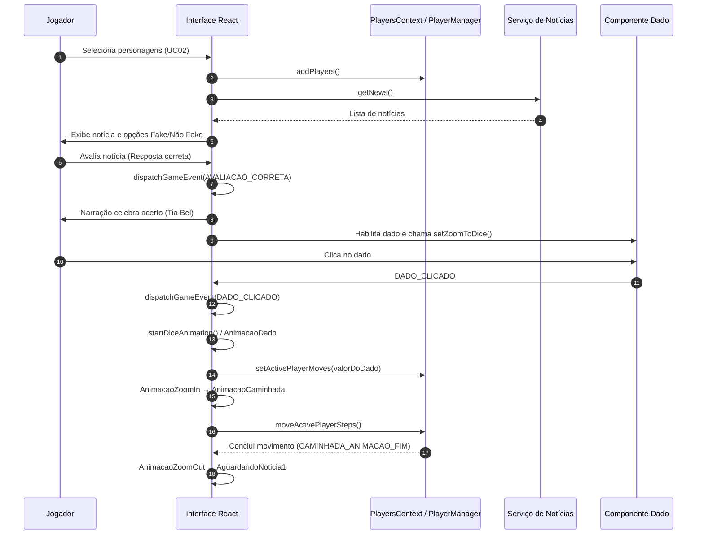
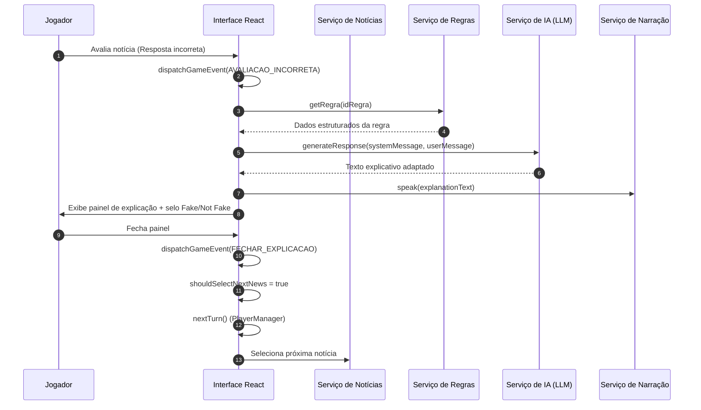

# Diagramas de Sequência – JEDi Educa

Este documento apresenta duas sequências centrais do jogo JEDi Educa: avaliação de notícia com acerto e avaliação com erro. Os diagramas utilizam notação Mermaid para facilitar a visualização dentro do repositório.

## Seqüência 1 – Avaliação Correta e Lançamento de Dado

## Seqüência 2 – Avaliação Incorreta e Explicação

## Notas Complementares
- Os diagramas focam no fluxo lógico. Efeitos visuais (zoom, animações) foram simplificados para clareza.
- O `PlayerManager` mantém controle de turnos e posições; suas interações foram sintetizadas nos diagramas como chamadas diretas.
- Serviços externos (News, Rules, LLM, Speech) estão desacoplados via `apiService`, `llmService` e `speechService`. Cada chamada inclui tratamento de erros e fallback na implementação real.

