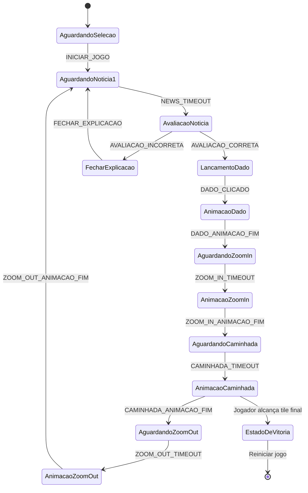

# Fluxos de Estados – JEDi Educa

## Visão Geral
Este documento descreve o ciclo de vida da partida no JEDi Educa, baseado na máquina de estados finitos definida no componente `App.tsx`. Cada transição é acionada por eventos que refletem ações do usuário, timers de interface ou callbacks de animação.

## Diagrama de Estados

## Descrição dos Estados
- **AguardandoSelecao**: fluxo inicial; aguarda escolha de personagens e carregamento de sprites. A transição ocorre após `dispatchGameEvent({ type: 'INICIAR_JOGO' })`.
- **AguardandoNoticia1**: atraso controlado (1 segundo) para carregar e exibir a próxima notícia. Timer dispara `NEWS_TIMEOUT`.
- **AvaliacaoNoticia**: aguarda input dos botões “Fake / Não Fake”. Ao receber avaliação correta ou incorreta, encaminha para os caminhos respectivos.
- **FecharExplicacao**: ativa após avaliação incorreta; mantém painel de explicação aberto até o usuário fechar, momento em que o evento `FECHAR_EXPLICACAO` retorna ao ciclo de notícias.
- **LancamentoDado**: habilita interação com o componente `Dice`. Apenas evento `DADO_CLICADO` prossegue.
- **AnimacaoDado**: controla animação de rolagem e zoom in; finaliza com `DADO_ANIMACAO_FIM`.
- **AguardandoZoomIn / AnimacaoZoomIn**: timers e animações que centralizam câmera no jogador antes do movimento.
- **AguardandoCaminhada / AnimacaoCaminhada**: prepara e executa deslocamento do jogador ativo. Ao concluir, dispara `CAMINHADA_ANIMACAO_FIM`.
- **AguardandoZoomOut / AnimacaoZoomOut**: restaura enquadramento geral após movimentação; encerra com `ZOOM_OUT_ANIMACAO_FIM`, retornando ao carregamento de notícias.
- **EstadoDeVitoria**: estado conceitual (não controlado pela FSM principal) disparado pelo `movementValidator` quando o jogador alcança um tile `fim`. Exibe painel de vitória e permite reinício do jogo, resetando a máquina para `AguardandoSelecao`.

## Eventos e Disparadores
- **Eventos de Usuário**: `INICIAR_JOGO`, `DADO_CLICADO`, avaliações (“Fake/Não Fake”), fechamento de explicação.
- **Timers**: `NEWS_TIMEOUT`, `ZOOM_IN_TIMEOUT`, `CAMINHADA_TIMEOUT`, `ZOOM_OUT_TIMEOUT` são agendados via `setTimeout` para sequenciar UI.
- **Callbacks de Animação**: `DADO_ANIMACAO_FIM`, `ZOOM_IN_ANIMACAO_FIM`, `CAMINHADA_ANIMACAO_FIM`, `ZOOM_OUT_ANIMACAO_FIM` são disparados após `Promise`/`requestAnimationFrame` que controlam animações.
- **Condições Especiais**: chegada ao tile final ou eventos de transporte (ex.: skate) manipula diretamente o fluxo, podendo marcar vitória ou ajustar posições antes de retornar à máquina principal.

## Observações
- A FSM funciona como controlador do ciclo “Notícia → Avaliação → Movimento → Nova notícia”.
- Interrupções externas (erros de rede, falta de notícias) mantêm o estado atual até que dados válidos estejam disponíveis.
- A FSM opera em conjunto com o `PlayerManager` para sincronizar turnos em modo multiplayer, garantindo que eventos sejam aplicados ao jogador ativo.

