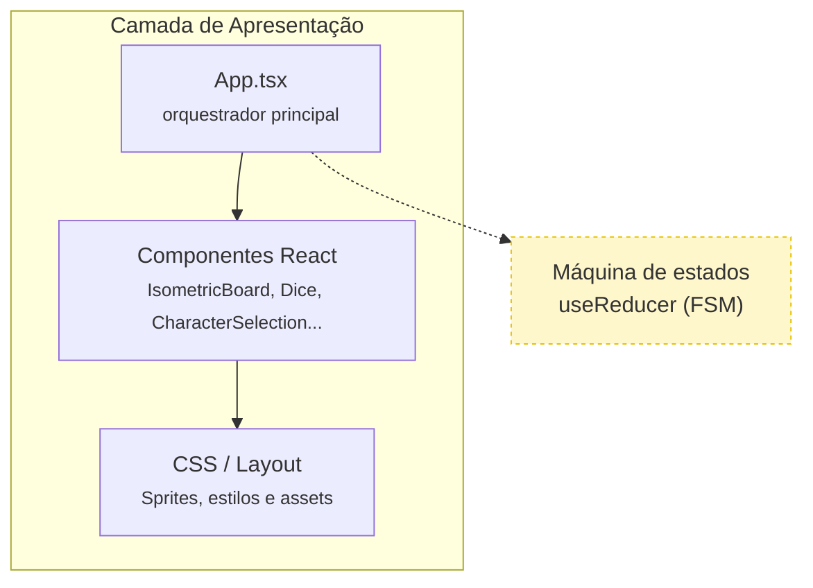
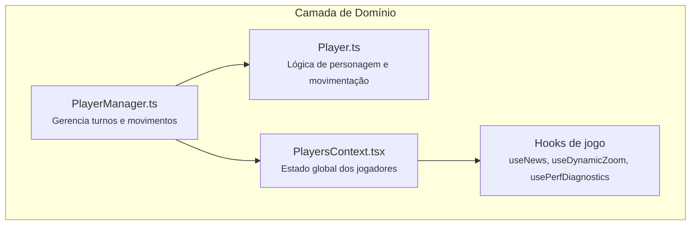
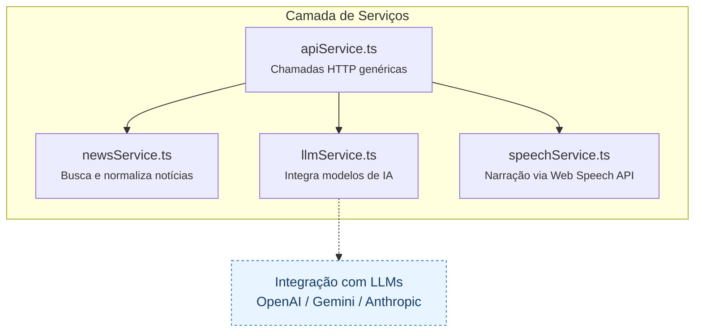
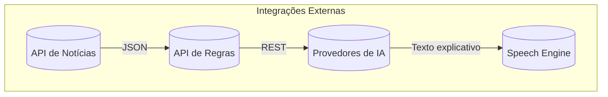
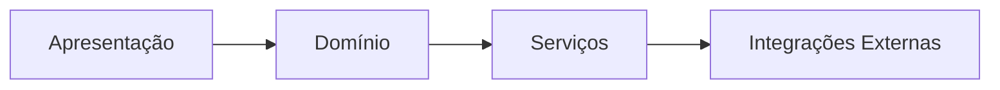

# Visão Arquitetural – JEDi Educa

## Objetivo
Este documento apresenta uma visão de alto nível da arquitetura do jogo **JEDi Educa**, destacando camadas, componentes principais, integrações externas e princípios adotados para garantir **extensibilidade, manutenibilidade e clareza de responsabilidades**.

---

## Contexto Geral
- **Frontend Web (React + TypeScript)**: aplicação single-page que roda no navegador, renderiza o tabuleiro isométrico, gerencia estados de jogo e integrações multimídia.  
- **Serviços Externos**: APIs REST fornecem dados de notícias e regras; serviços de IA geram explicações personalizadas; sintetizador de voz narra resultados.  
- **Recursos Estáticos**: sprites, mapas e assets ficam em `public/` e `src/assets/`.  

---

## Visão de Camadas

### 1. Camada de Apresentação

**Descrição:**  
A camada de apresentação é responsável pela interface e interação do usuário.  
- **`App.tsx`** orquestra o fluxo principal, incluindo a máquina de estados do jogo.  
- **Componentes React** são altamente modulares e reutilizáveis.  
- **Estilos e sprites** garantem a identidade visual e o clima lúdico.

---

### 2. Camada de Domínio

**Descrição:**  
- **`PlayerManager`** coordena a lógica de jogo, turnos e posições.  
- **`Player`** encapsula regras e comportamentos dos personagens.  
- **Contextos e hooks** mantêm estados compartilhados e abstrações reutilizáveis.  
- **FSM** (máquina de estados) define o fluxo principal do jogo.

---

### 3. Camada de Serviços

**Descrição:**  
Camada que abstrai integrações e fornece uma interface estável ao domínio.  
- **`apiService`** centraliza requisições HTTP e tratamento de erros.  
- **`newsService`**, **`llmService`** e **`speechService`** são especializados em cada tipo de integração.  
- O design permite adicionar novos provedores de IA ou motores de voz sem alterar o restante do sistema.

---

### 4. Integrações Externas

**Descrição:**  
Essas integrações representam serviços fora do controle direto da aplicação, mas essenciais para o jogo:  
- APIs de notícias e regras.  
- Provedores de IA para explicações contextuais.  
- Motor de voz embutido no navegador (Web Speech API).  

---

### 5. Relação entre as Camadas

**Descrição:**  
Fluxo de comunicação principal da aplicação:  
1. O usuário interage com a **UI**.  
2. A **UI** aciona a **camada de domínio** (lógica de jogo).  
3. O **domínio** solicita dados e funcionalidades à **camada de serviços**.  
4. Os **serviços** integram-se com as **APIs externas**.  

---

## Fluxos Arquiteturais Relevantes
1. **Bootstrap da Partida**: `App.tsx` inicia `PlayersContext`, carrega mapa (`IsometricBoard`), registra callbacks de câmera e busca notícias iniciais.  
2. **Seleção de Personagens**: `CharacterSelection` envia lista escolhida para `App.tsx`, que aciona `addPlayers` do `PlayerManager` e pré-carrega sprites.  
3. **Avaliação e Movimento**: após avaliação correta, `App.tsx` dispara eventos da FSM e coordena animações (`useDynamicZoom`, `setActivePlayerMoves`, `moveActivePlayerSteps`).  
4. **Narração**: respostas do LLM são passadas para `speechService.speak`, que utiliza Web Speech API para reprodução.  
5. **Monitoramento de Performance**: `perfDiagnostics` registra eventos críticos para depuração e otimização.  

---

## Decisões Arquiteturais
- **React Context para multiplayer**: centraliza estado de jogadores e minimiza prop drilling.  
- **Máquina de estados explícita**: facilita depuração de fluxo complexo (notícia → dado → movimento).  
- **Pré-carregamento de sprites**: garante UX fluida em dispositivos de baixa performance.  
- **Uso de hooks customizados**: `useNews`, `useDynamicZoom`, `usePerfDiagnostics` segregam preocupações e simplificam testes.  

---

## Considerações de Evolução
- **Suporte a multiplayer online** — exigirá backend de sincronização.  
- **Persistência de progresso** — via IndexedDB ou APIs REST.  
- **Entrega offline (PWA)** — caching de assets e dados.  
- **Monitoramento em produção** — integração com Sentry / LogRocket.  

---

## Requisitos Não Funcionais Relacionados
- **Performance**: manter fluidez em hardware escolar (Chromebooks, tablets Android).  
- **Acessibilidade**: suporte a narração, contraste adequado, navegação por toque.  
- **Manutenibilidade**: modularização e uso de TypeScript.  
- **Observabilidade**: logs e telemetria para diagnóstico.  

---

*Esta visão arquitetural complementa os casos de uso e diagramas de sequência do projeto JEDi Educa, fornecendo base sólida para evolução técnica e comunicação entre equipe pedagógica e de desenvolvimento.*

